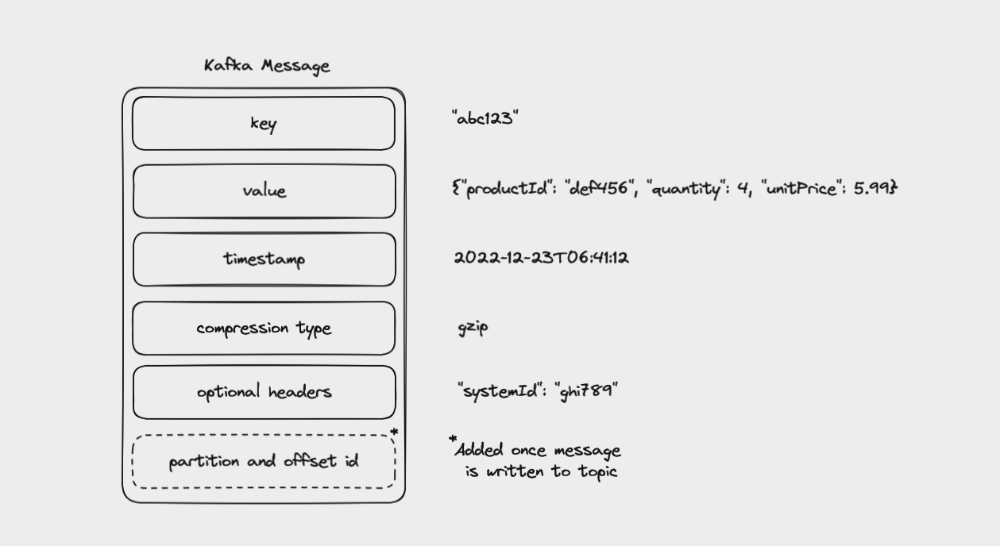
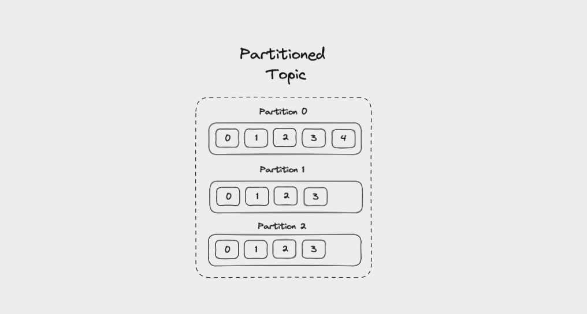
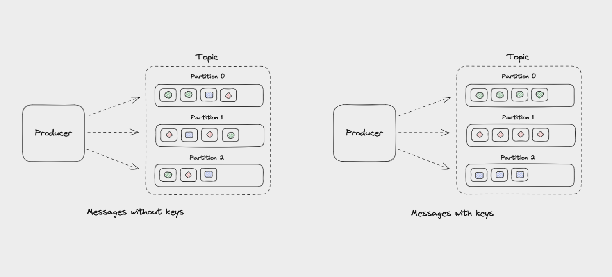
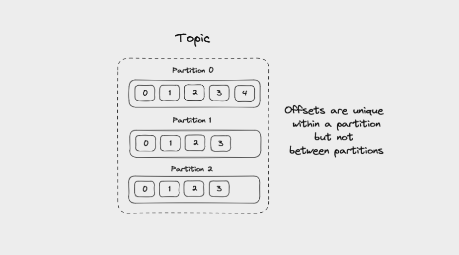
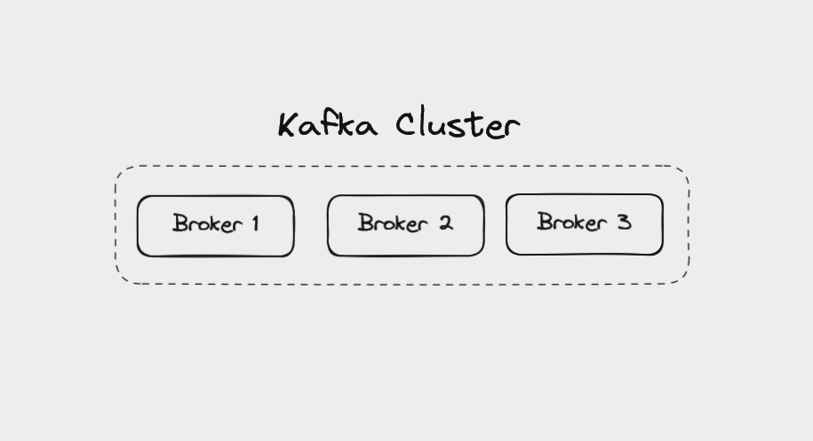
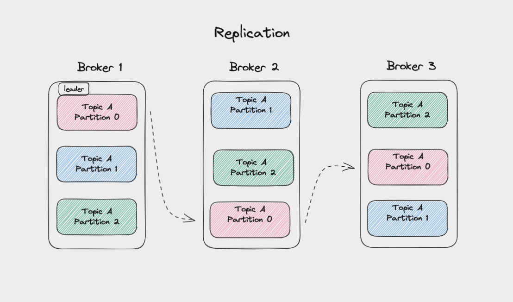
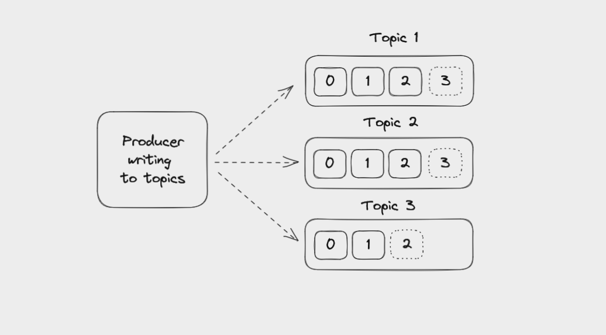
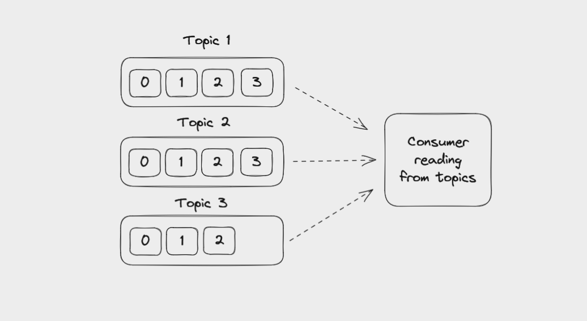
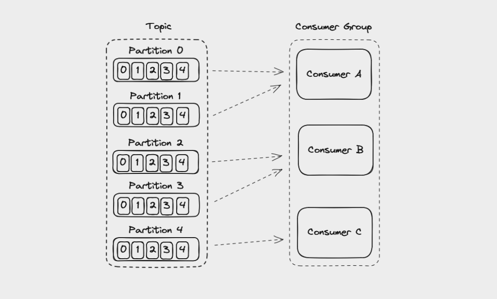
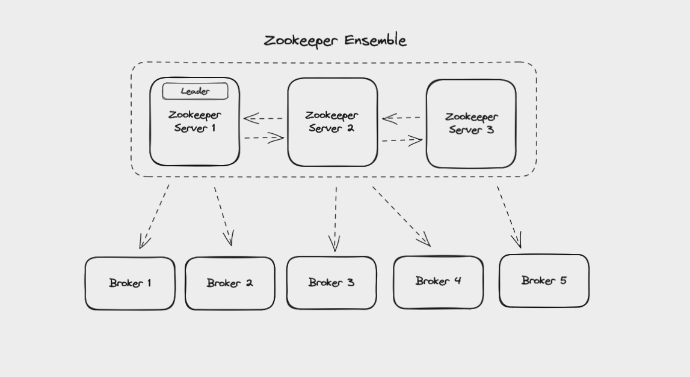

# Основные концепты кафки

1. Как устроены сообщения в кафке
   * a key
   * a value
   * a timestamp
   * a compression type
   * headers for metadata (optional)
   * partition and offset id (once the message is written to a topic)

2. Топики в кафке
   * Топик - упорядоченная последовательность сообщений   
   * Вычитывание сообщения не удаляет его из топика 
   * Кафка хранит сообщение в топике 7 дней (по дефолту)

3. Партиции в кафке

Топик разделяется на разделы.
На изображении топик разделен на три партиции

* Если у сообщения нет ключа, то сообщения будут разделены между партициями по алгоритму RoundRobin. 
* Если же к сообщению добавить ключ, то партиция будет вычисляться по хешу ключа.

4. Оффсеты в кафке

Для каждого топика своё смещение (оффсет). 
При добавлении нового сообщения происходит смещение индекса (прибавление единички).
Оффсет уникален для каждолго сообщения внутри партиции, но между партициями оффсеты совпадают.
Оффсет не используется повторно, когда предыдущее значение удалилось.

5. Брокеры

Если мы на одном сервере развернули кафку, то можем смело называть его брокером.
Но, если мы объединим брокеры в кучу, то тогда можно называть эту банду кластером.  

Когда клиент подключается к одному брокеру, то кафка подключает его ко всем брокерам.

6. Реплики

Что бы мы не потеряли данные, кафка синхронизует копии партиций между брокерами.
Копия берется с лидера и рассылается по подписчикам. Число брокеров, на которое будет сохранена копия
партиций указывается в конфигурации.

7. Отправители (продюсеры)

Продюсер пишет в разные топики
Продюсер никак не связан с получателем, продюсер выполняет свою роль - отправку сообщений

8. Получатели (конзумеры)

Читают сообщения из топиков. Порядок получения сообщений не гарантируется, 
на стороне получателя необходимо самому решать эту проблему

По дефолту консумер читает сообщение с текущего (для себя) смещения, 
но можно програмно указать с какого этапа читать

Консумер преобразует байтовую информацию в текстовую (key, value)

9. Группа получателей

Группа консьюмеров может разбить чтение партиций из одного топика между собой
При добавлении нового получателя в группу, кафка сама перебалансирует чтение партиций
Партиция может отдавать сообщения лишь одному консьюмеру в группе, 
но консьюмер может читать из нескольких партиций

10. Зукиппер
                   
Он отвечает за управление и синхронизацию распределенных систем. 
                 
Обязанности зукиппера:
* определение брокеров, которые являются частью кластера
* Определение лидера для раздачи партиций
* Настройка топиков, например, количество разделов и расположение реплик
* Управления группой консумеров
* Ведение WhiteList

